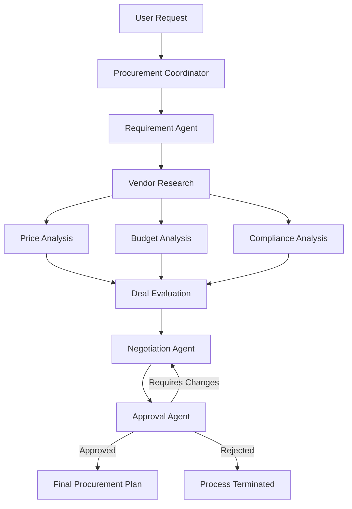

# DealForge AI
**Multi-Agent Procurement and Vendor Negotiation System**

## Problem Statement
Traditional procurement is a slow, manual process involving comparing multiple vendors, ensuring policies are met, negotiating prices, and seeking approvals. Humans can struggle to balance complex constraints (budget, warranty, delivery time) simultaneously for multiple vendors.

## Project Objective
Build an agentic AI procurement system where multiple specialized AI agents collaborate to help a company purchase products/services from vendors. Instead of just picking the cheapest option, it holistically evaluates overall value and automatically negotiates better terms before seeking human approval.

## Architecture
DealForge AI is a stateful multi-agent system built using LangGraph and FastAPI. It follows a decentralized but orchestrated approach where specialized agents communicate via a shared structured state.

### Agent Workflow

### Why Multi-Agent?
- **Separation of Concerns**: Each agent has a focused prompt and toolset, reducing hallucinations and improving task execution.
- **Parallel Execution**: Vendor research, price, budget, and compliance checks can run concurrently, saving time.
- **Dynamic Replanning**: If a constraint changes (e.g., budget drops), only affected agents need to rerun instead of restarting from scratch.
- **Human-in-the-Loop**: An Approval Agent safely pauses execution before any binding purchase decisions are made.

## Technology Stack
- **Backend Framework**: FastAPI (High performance, excellent typing support via Pydantic).
- **Agent Orchestration**: LangGraph (Stateful workflow, allows loops and conditional branching).
- **LLM Interface**: LangChain (Extensible for OpenAI, Gemini, Groq).
- **Data Models**: Pydantic (Strict typing for agent inputs and outputs).
- **Frontend (Future)**: React / Streamlit.

## Installation
1. Clone the repository
2. Create a virtual environment: `python -m venv venv`
3. Activate the environment: `venv\Scripts\activate` (Windows) or `source venv/bin/activate` (Mac/Linux)
4. Install dependencies: `pip install -r requirements.txt`
5. Copy `.env.example` to `.env` and add your API keys.